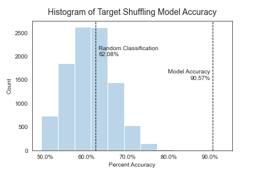

# Market Research Cluster Analysis

## Introduction
Interpreting consumer product market research data can be a daunting task.  Researchers may collect user input on dozens of variables, and then it is up to analysts to interpret and generalize those results into meaningful market segments and actionable insights.  The goal of this project has been to create a repeatable, efficient, and technically sound approach to uncovering latent market segments from market research data and to identify variables that are most influential in defining those market segments so marketing and product development teams can more efficiently reach their target audiences.

The final deliverable of this project is a [web application](https://share.streamlit.io/ericpostmaster/market-research-cluster-analysis/main/app.py) where end-users can upload their datasets for analysis and receive clustered results as well as a ranked list of the most influential variables.  The immediate business impact of the influential variable list is the ability to use relatively few variables to identify clusters and then use the other associated variables to create messaging or other content that will resonate with the target audience.

The latest classification model has achieved a 90.57% accuracy, compared to just 61.94% accuracy through random classification.

## App In Action

## Data
The data collected in these experiments is formatted in a specific and consistent way, which includes an anonymized participant ID, a baseline constant, and columns for each of the tested variables (aka stimuli).

## Analysis
The analysis for this tool is comprised of three major components: Factor Analysis, Clustering, and Classification.

### Factor Analysis
The analysis script begins with dimension reduction through factor analysis.  The purpose of the factor analysis, as opposed to just clustering on the raw customer data, is to reduce noise in the initial dataset and hopefully obtain factors that are more generalizable to future, unseen data.

The variables are all on a similar scale, so the script uses the covariance matrix for identifying principal components.

### Clustering
The clustering portion of the latest script creates and compares clustering solutions for 2-7 clusters using k-Means, k-Medoids, and hierarchical algorithms.  It uses the silhouette score, which is calculated using the average distance of points within a cluster (intra-cluster distance) and the average distance between clusters ([sklearn silhouette score documentation](https://scikit-learn.org/stable/modules/generated/sklearn.metrics.silhouette_score.html)).

The optimal clustering solution is selected based on the highest silhouette score and serves as the labeled data used in the training, validation, and test data.

#### Business Note:
In a business setting, the optimal clustering solution would need to be validated as useful before being used to classify new customer data.  For the sake of expediency, this project assumes that the clusters are representative of customer groups.

### Classification
After splitting the clustered data into training, validation, and test sets, classifiers are trained using Random Forest, gradient boosted trees, support vector classification, and k-Nearest Neighbors.  Accuracy is used to select the optimal classification model.  We selected accuracy as our primary metric instead of precision and recall because there are no "false positive" or "false negative" outcomes, and misclassification of any one cluster does not cost any more or less than any other cluster.  Another benefit of using accuracy is that it is easily understood by end-users.

Individual variable importance is obtained by averaging the feature importance outputs of the Random Forest and gradient boosted trees algorithms.  In the initial analysis, 7 out of the top 10 variables appeared in both lists.

#### Assessing Model Quality
We used target shuffling to assess the quality of the classification model because it is suitable for data with multiple unordered levels (e.g. cluster 1, 2, or 3). The final model results are compared to scores for 10,000 random shuffles of the target variable, with the resulting difference charted in the histogram below.

## Web Application
The web application was built using Streamlit and can be accessed [here](https://share.streamlit.io/ericpostmaster/market-research-cluster-analysis/main/app.py).  Big thanks to Streamlit for inviting us to be a part of their Streamlit Share testing group!  Test data can be downloaded <a href="customer_data.csv" download="sample_data.csv" target="_blank">here</a>.
